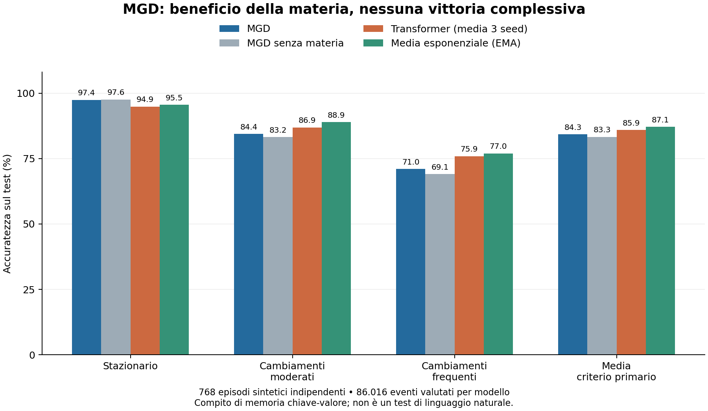

# MGD contro un Transformer: esperimento e verifica delle equazioni

25 settembre 2026 — esecuzione reale su CPU, risultati conservati.

**Esito: questo prototipo MGD non supera il Transformer nell'accuratezza
complessiva. La materia produce un miglioramento misurabile all'interno del
prototipo, ma una semplice media esponenziale supera entrambi.**

Non è una valutazione completa della teoria MGD, né una prova su tutti i
Transformer. È un primo confronto controllato su una funzione concreta:
ricostruire una memoria da osservazioni rumorose, anche quando i fatti cambiano.
Il precedente modulo relazionale dell'app e questo prototipo sono implementazioni
diverse. Questo esperimento non modifica l'APK.

## Risultato principale

Accuratezza percentuale su episodi di test separati dalla selezione dei parametri:

| Sistema | Stazionario | Cambiamenti moderati | Cambiamenti frequenti | Media primaria |
|---|---:|---:|---:|---:|
| MGD | 97,43 | 84,37 | 71,02 | **84,27** |
| MGD senza materia, riselezionato | 97,57 | 83,19 | 69,09 | 83,28 |
| MGD senza termine di memoria, stessi altri parametri | 96,99 | 85,28 | 72,97 | 85,08 |
| MGD senza tetto ai costi, riselezionato | 97,46 | 85,26 | 68,37 | 83,70 |
| Transformer, media di tre addestramenti | 94,86 | 86,86 | 75,89 | **85,87** |
| Media esponenziale, EMA | 95,55 | 88,89 | 76,98 | **87,14** |
| Conteggi cumulativi | 97,86 | 78,42 | 56,35 | 77,54 |
| Ultima osservazione | 80,15 | 80,37 | 79,73 | 80,08 |
| Risposta costante, senza memoria | 25,12 | 24,98 | 25,13 | 25,07 |
| Bayes con generatore noto, riferimento privilegiato | 97,94 | 89,06 | 79,73 | 88,91 |



La media Transformer è la media delle accuratezze dei tre modelli, non un
ensemble che vota sulle risposte. Le loro accuratezze complessive sono
85,83%, 85,94% e 85,84%. Non è stato scelto il seed migliore sul test.

Differenze appaiate: MGD meno il sistema indicato, in punti percentuali.
Intervalli bootstrap al 95%, con l'intero episodio come unità indipendente:

| Confronto | Differenza | Intervallo 95% |
|---|---:|---:|
| Transformer | **−1,60** | [−1,80; −1,40] |
| EMA | **−2,87** | [−3,09; −2,64] |
| MGD senza materia, riselezionato | **+0,99** | [+0,91; +1,07] |
| MGD senza termine di memoria | **−0,81** | [−0,91; −0,70] |

Il criterio fissato nel [protocollo](PROTOCOL.md) richiedeva un vantaggio
positivo su Transformer, EMA e variante senza materia, con i controlli superati.
**Il criterio non è soddisfatto.** Il vantaggio su Transformer nello scenario
stazionario è un risultato circoscritto: in quello stesso scenario i conteggi
cumulativi raggiungono un'accuratezza maggiore di MGD.

## Cosa dimostra e cosa suggerisce

La rimozione della materia peggiora le predizioni a parità degli altri parametri.
Il peggioramento rimane dopo la ricerca in validazione dei parametri della
variante senza materia. Questo è un contributo causale del meccanismo
implementato al risultato del benchmark, non una convalida dell'intera teoria.

La rimozione del termine di memoria migliora invece il risultato medio. La
perdita di MGD cresce negli scenari con cambiamenti. Questi dati sono coerenti
con un eccesso di persistenza dello stato, ma non identificano da soli tutta
la causa: soglie, clipping, aggiornamento della materia e decodifica interagiscono.
Nell'ablazione senza memoria il costo resta uno stato persistente; non è un
sistema completamente privo di memoria.

La conclusione utile non è che tutta la matematica sia inutile: esistono
componenti dinamiche utilizzabili e una di esse migliora questo prototipo.
**Manca però un vantaggio rispetto a controlli più semplici, e la stabilità di
una dinamica non è un teorema di accuratezza predittiva.**

## Esperimento effettivamente eseguito

- Otto chiavi, quattro valori possibili, 128 eventi per episodio. Ogni evento
  mostra una chiave e un valore rumoroso. Si predice il valore latente corrente
  della chiave dopo aver ricevuto l'osservazione. Nessuna risposta corretta è
  fornita durante l'uso della memoria nel test.
- Rumore del 20%; probabilità di cambiamento per visita della chiave pari a
  0%, 6% oppure 20%. Stesso flusso di osservazioni per ogni sistema.
- Validazione: 64 episodi per scenario. Test: 256 per scenario, 768 in tutto.
  Valutati gli eventi 17–128: 86.016 risposte per modello. Queste risposte
  correlate non sono trattate come 86.016 campioni indipendenti.
- MGD: 54 configurazioni selezionate esclusivamente in validazione. Nessun
  addestramento a gradiente, ma la selezione dei parametri usa etichette di
  validazione: non è un sistema costruito senza alcuna supervisione.
- Transformer causale: due blocchi, dimensione 48, quattro teste, 38.788
  parametri; tre inizializzazioni, 800 aggiornamenti ciascuna, 3.276.800 eventi
  di addestramento per inizializzazione. Checkpoint scelto sulla validazione.
  Training circa 35–40 secondi per seed in questo ambiente.
- Bootstrap appaiato, stratificato per scenario, 3.000 ricampionamenti. Gli
  intervalli condizionano sui checkpoint ottenuti: non descrivono tutta la
  variabilità possibile di architetture e addestramenti.

MGD dispone di indirizzamento chiave-valore esplicito; il Transformer impara
a usare il contesto. I budget e le conoscenze incorporate nella progettazione
sono diversi. Si confrontano questi sistemi su questo compito, non il massimo
potenziale delle rispettive famiglie.

### Collegamento tra equazioni e codice

Il prototipo usa la memoria esponenziale, il costo con drift, la ricorrenza
logistica della materia e la correzione del costo rispetto all'equilibrio.
La materia entra nella scelta della risposta attraverso il costo; non è
soltanto un contatore visualizzato.

Sono adattamenti progettuali aggiunti al paper: uno stato per coppia
chiave-valore, aggiornamento al tempo locale della chiave, indicatore di
attivazione su un singolo arco, separazione costo-base/costo corretto,
eventuale tetto ai costi e scelta del valore di costo minimo. La coerenza media
è stimata online e usata in una formula di equilibrio deterministico: è una
euristica, non un'identità esatta per il processo stocastico accoppiato.

Non sono implementati qui la griglia infinita dei paper, curvatura Ricci,
dimensione emergente, linguaggio naturale, ricerca web o apprendimento visuale.
Questi risultati non si trasferiscono automaticamente all'app Android.

## Controlli e tracciabilità

Tutti e tre i Transformer raggiungono il 100% sul controllo separato senza
rumore. Modificare le osservazioni future cambia di **0** i logit precedenti.
Questi controlli verificano l'interfaccia e la causalità; non dimostrano che
l'architettura o il budget siano ottimali.

[verify_results.py](verify_results.py) ha riprodotto esattamente le predizioni
dai tre checkpoint e quelle MGD, ricalcolato accuratezze e intervalli dai dati
conservati, verificato l'hash del test e controllato che le risposte MGD non
dipendano dalle etichette di test né dalle osservazioni future.
Esito: [tutti i controlli superati](results/verification.json).

Il protocollo e il codice iniziale sono nel commit locale `6dd274d`, antecedente
alla valutazione finale e conservato in [protocol-freeze.bundle](protocol-freeze.bundle).
La pubblicazione remota è successiva all'esperimento: non è una preregistrazione
esterna né una marcatura temporale indipendente. La prima esecuzione ha
completato training e valutazione ma ha incontrato un errore nella scrittura
JSON di un booleano NumPy. È stato corretto soltanto l'output e aggiunto il
caricamento dei checkpoint; la valutazione è stata rieseguita con gli stessi
pesi, dati, parametri e criteri. Entrambi i log sono conservati. Nessuna
riottimizzazione dopo aver visto il test.

I tempi di inferenza in JSON sono misure grezze singole di throughput per un
batch di 256 episodi, su CPU e con implementazioni differenti. Non sono misure
robuste di latenza per evento, energia, velocità di apprendimento o prestazioni
sul telefono. Non fondano una rivendicazione di superiorità computazionale.

## Audit matematico e direzione di sviluppo

L'[audit delle equazioni](MATHEMATICAL_AUDIT.md) contiene derivazioni e
controesempi riproducibili. Due punti centrali:

1. Nel paper principale la formula del punto fisso ha il segno incompatibile
   con la ricorrenza. Il secondo supplemento, p.38, usa già il polinomio corretto:
   occorre rendere coerenti i documenti e le implementazioni.
2. La condizione di invarianza dichiarata e l'equivalenza tra positività del
   parametro di rilassamento e stabilità discreta richiedono correzioni.
   Il benchmark usa parametri dentro il dominio corretto.

Per proseguire, la priorità è un aggiornamento della memoria guidato dall'errore
predittivo e capace di correggere fatti cambiati. La coerenza geometrica o
l'attivazione di un arco non costituiscono da sole evidenza di correttezza.
[Titans](https://arxiv.org/abs/2501.00663),
[Test-Time Training](https://arxiv.org/abs/2407.04620) e i
[fast weights con regola delta](https://arxiv.org/abs/2102.11174) offrono
esempi di memorie aggiornate con obiettivi o regole di correzione espliciti.
Sono riferimenti progettuali, non sistemi riprodotti in questo esperimento.

Il passo successivo motivato dai dati è confrontare un aggiornamento MGD
guidato dall'errore con EMA e regola delta, mantenendo le ablazioni della materia,
su **nuovi** dati di test e con un protocollo fissato prima della valutazione.
Integrare un meccanismo dall'articolo non garantisce di superare i Transformer.
Non sono stati creati né numeri di vittoria né una nuova versione dell'APK
presentata come superiore in assenza di tali risultati.

## Riproduzione

Python 3.12, CPU, due thread. Dalla directory di questo esperimento:

```bash
python -m pip install numpy==2.3.5 matplotlib==3.10.8
python -m pip install torch==2.8.0 --index-url https://download.pytorch.org/whl/cpu
python math_checks.py
python verify_results.py
```

Per ripetere selezione, training e test in una nuova cartella:

```bash
python -u benchmark.py --out replicated_results
```

Per rivalutare i checkpoint conservati, senza addestramento:

```bash
python -u benchmark.py --out results --resume-evaluation
python verify_results.py
python plot_results.py
```

Quest'ultimo comando di benchmark sovrascrive i JSON e i tempi nella cartella
indicata. Per conservare anche i file originali, lavorare su una copia del
repository. Versioni differenti di librerie e hardware possono cambiare tempi
e dettagli numerici.

File di prova: [risultati completi](results/results.json),
[pesi seed 21](results/transformer_21.pt),
[pesi seed 22](results/transformer_22.pt),
[pesi seed 23](results/transformer_23.pt),
[dati di test](results/test_streams.npz),
[predizioni](results/predictions.npz),
[hash SHA-256](results/SHA256SUMS.txt),
[log iniziale](run.log), [log della rivalutazione](evaluation.log).
